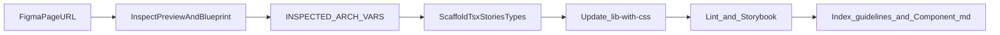

# Figma → ArchUI (single component)

End-to-end workflow: **one Figma page URL** → **one component folder** in `src/components/{ComponentName}/`, types in `src/types/components/`, barrel exports in `src/lib-with-css.ts`, **guidelines hub refresh**, and **`guidelines/components/{ComponentName}.md`**. Work in **small verifiable steps**.

## Naming: avoid skill collisions

Use **`INSPECTED_ARCH_*`** only (never bare `INSPECTED_COMPONENT` / `INSPECTED_PROPS`) so payloads stay distinct from sibling Figma skills (e.g. blueprint-copy’s `INSPECTED_INSTANCE` / `INSPECTED_COMPONENT`).

| Variable | Meaning |
|----------|---------|
| **`INSPECTED_ARCH_COMPONENT`** | Structured facts from the **preview** frame (e.g. `DS/{Component}/Preview`): variant axes and **defaults**, layout (grid/flex), typography/text styles, token-backed colors/radii/spacing (`get_variable_defs` / design-context), icon **intent** (implement with **react-icons**), interactive states, and **distinctive layer/frame labels** used to mirror DOM wrappers and **`archui-*`** hooks ([see DOM hooks](#dom-hooks--figma-layer-parity)). |
| **`INSPECTED_ARCH_PROPS`** | Structured facts from the **blueprint** frame (e.g. `C{num}-{Component}-Blueprint-Light`): **Blueprint-Left-Info** copy plus **DOC Props table** / `{Component}` instance — prop names, types, defaults, descriptions. **Usage / purpose text from the blueprint is the primary source for Storybook’s component description** (see **`{ComponentName}.stories.tsx`** in scaffold table below). |

## Mandatory reads before codegen

1. [guidelines/Guidelines.md](guidelines/Guidelines.md) — then, in order: `setup.md`, `colors.md`, `radii-spacing.md`, `typography.md` under `guidelines/`. After codegen for a **new** component, apply **steps 9–10** so docs stay discoverable.

   **Downstream / installed package:** the same tree ships on npm at `node_modules/@devtoti/archui-lib/guidelines/` (see package `README.md`). Point coding agents, Figma Make, and design-to-code tools at that path when the consumer project depends on `@devtoti/archui-lib` rather than this monorepo checkout.
2. Templates (structure, author header, `cva`/`twMerge`/Slot, stories): [Alert.tsx](src/components/Alert/Alert.tsx), [Toast.tsx](src/components/Toast/Toast.tsx), [Alert.stories.tsx](src/components/Alert/Alert.stories.tsx), [Toast.stories.tsx](src/components/Toast/Toast.stories.tsx), [Alert.types.ts](src/types/components/Alert.types.ts).

### React imports & Fast Refresh

In **`{ComponentName}.tsx`**, use **named** React APIs — do **not** default-import `React` for hooks or `forwardRef`:

```ts
import { forwardRef, useId, useState, type FC, type ElementRef } from "react";
```

| Pattern | Use |
|---------|-----|
| `React.forwardRef` | `forwardRef` |
| `React.useState` / `useEffect` / `useMemo` / `useId` | named imports |
| `React.FC<Props>` | `type FC` import |
| `React.ElementRef<…>` | `type ElementRef` import |
| `React.HTMLInputTypeAttribute` | `type HTMLInputTypeAttribute` import |

Reference: [Input.tsx](src/components/Input/Input.tsx), [Radio.tsx](src/components/Radio/Radio.tsx), [Avatar.tsx](src/components/Avatar/Avatar.tsx).

When the same file exports **`cva`** variant helpers **and** components, keep Fast Refresh happy without splitting files:

- **One variant export** — `eslint-disable-next-line` above it ([Button.tsx](src/components/Button/Button.tsx)).
- **Several `export const …Variants`** — wrap the variant block in disable/enable ([Input.tsx](src/components/Input/Input.tsx)):

```ts
/* eslint-disable react-refresh/only-export-components -- cva tokens for lib consumers */
export const inputRootVariants = cva(/* … */);
export const labelRowVariants = cva(/* … */);
/* eslint-enable react-refresh/only-export-components */
```

- **Re-exporting consts** — `eslint-disable-next-line` above `export { a, b, c }` ([Radio.tsx](src/components/Radio/Radio.tsx)).

Do **not** split variant exports into another file unless the user asks.

## 1. Resolve URL and inspect Figma

From a `figma.com/design/` URL extract **`fileKey`** and **`nodeId`** (hyphens → colons in IDs; branch URLs use branch key as `fileKey`).

- Use the **official Figma MCP**: **`get_design_context`** on the page or on the **preview** and **blueprint** subtrees once IDs are known; use **`get_metadata`** when a lighter tree listing helps (layer/frame **names** for DOM hints); use **`get_variable_defs`** for tokens scoped to the component.
- Before every **`use_figma`** call, load the **figma-use** skill (prerequisite) and follow its instructions.

Locate:

- **Preview** frame (often `DS/{Component}/Preview`) → populate **`INSPECTED_ARCH_COMPONENT`**. Pull **distinctive layer/frame names** from metadata (and design-context output where labels appear) so the **most recognizable regions** of the React tree mirror Figma grouping — not every nested auto-layout shim needs a mapped name; prioritize nodes that clarify composition, state, or QA (e.g. image vs fallback vs status).
- **Blueprint** frame (often `C{num}-{Component}-Blueprint-Light` with **Blueprint-Left-Info** + props table / component instance) → populate **`INSPECTED_ARCH_PROPS`**.

### DOM hooks & Figma layer parity

Apply **`archui-*`** `className` hooks and wrapper structure when implementing from Figma (`archui-{componentName}` on the purposeful root; `archui-{componentName}-{element}` on distinctive children). Use **distinctive preview layer/frame names** from **`get_metadata`** / design context to steer wrappers and landmarks; omit hooks on insignificant layout-only divs.

**Always prefix hooks with `archui-`.** Every `className` string you add **for design-system identification** (searchability in DevTools, parity with component structure) **must** start with **`archui-`**, even when Figma layers use different wording or omit any prefix entirely. Layers guide **which region** exists and sometimes the **`-{element}`** slug (normalized to **kebab-case**); **do not** paste layer names verbatim as hook classes unless you still normalize them to **`archui-{componentName}`** / **`archui-{componentName}-{element}`**.

1. **Map Figma to slugs** — Where preview labels are meaningful (`Status ring`, `Image`, `Fallback text`), derive the **`{element}`** segment (e.g. `status`, `img`, `fallback`) and assemble **`archui-{componentName}-{element}`**. Where labels are vague, pick a concise descriptive **`{element}`** and stay within the **`archui-`** pattern below.
2. **Shape:** **`archui-{componentName}`** on the purposeful root; **`archui-{componentName}-{element}`** on distinctive children (e.g. **`archui-avatar`**, **`archui-avatar-status`**, **`archui-avatar-fallback`**, **`archui-avatar-img`**).
3. **Declaration order:** On the **component root** and on **every descendant** that uses a hook, make the **`archui-*`** token the **first** class in authored `className` — **before** any Tailwind or other utilities (`flex`, `bg-arch-*`, etc.). Keep that order through **`twMerge`** / **`cva`** (e.g. lead **`base`** strings with **`archui-{componentName}`**, or pass the hook as the first argument when merging external `className`).
4. **Composition** — Combine hooks with **`className`** utilities (**`twMerge`** / **`cva`**) so merges stay deterministic and DevTools **`Cmd+F`** stays reliable library-wide.

**Intent:** reviewers and consumers can identify design-system subtrees quickly; structure reflects Figma where it matters, with a **single, searchable `archui-` naming scheme** on every labeled hook.

## 2. Scaffold files

Under **`src/components/{ComponentName}/`**:

| File | Requirements |
|------|----------------|
| **`{ComponentName}.tsx`** | Match Alert/Toast style: file header, `cva` variants, `twMerge`, `@radix-ui/react-slot` when `asChild` applies; **[React imports & Fast Refresh](#react-imports--fast-refresh)** (named hooks / `forwardRef`, eslint on co-exported `cva`); **`defaultVariants` must match `INSPECTED_ARCH_COMPONENT` defaults**; ArchUI token utilities (`bg-arch-*`, `text-arch-*`, `p-arch-*`, borders, shadows); responsive **`flex` / `grid`** and sensible breakpoints when the layout demands it. **`archui-{componentName}`** (and **`archui-*`** descendants) **`must`** appear **before** Tailwind utilities in each `className`. **DOM hooks:** follow **[DOM hooks & Figma layer parity](#dom-hooks--figma-layer-parity)** so DevTools parity and searchability stay consistent with the design file. |
| **`{ComponentName}.stories.tsx`** | Import `../../index.css`; CSF `meta` with **`argTypes`** aligned to **`INSPECTED_ARCH_PROPS`** and Figma; defaults match **`INSPECTED_ARCH_COMPONENT`**. **Docs / usage (`parameters.docs.description.component`, and `subtitle` if present):** Start from Figma’s component usage / purpose copy in **`INSPECTED_ARCH_PROPS`** (Blueprint-Left-Info and related blueprint strings). **Then** append ArchUI integration notes: consumers need **`ThemeProvider`** at the app root (see [guidelines/setup.md](guidelines/setup.md)), and Storybook previews typically wrap examples in **`ThemeSwitcher`** for fast theme previews — except **`AllThemes`** (below). At least **three** stories (e.g. `AllSizes`, `AllStates`, `AllThemes`). **`AllSizes` / `AllStates` (and any other story that isn’t `AllThemes`):** wrap the rendered example in **`ThemeSwitcher`** from `../ThemeSwitcher` (e.g. doric / ionic / corinthian), matching patterns in [Alert.stories.tsx](src/components/Alert/Alert.stories.tsx) / [Heading.stories.tsx](src/components/Heading/Heading.stories.tsx). **`AllThemes`:** render **one column or row of examples**; for **each** preview, wrap **only that subtree** in **`ThemeProvider`** from `../ThemeProvider` with the matching `theme` (`doric` \| `ionic` \| `corinthian`) and appropriate `themeType` / props used elsewhere in the library. **Do not use `ThemeSwitcher` in `AllThemes`.** Keep layouts simple. |

## 3. Icons

Use **`react-icons` only** (named imports from subpaths, e.g. `react-icons/md`, `react-icons/fi`, `react-icons/rx`). No raw SVG files, no other icon libraries, no image assets unless the user explicitly overrides. Verify the imported icon actually exists and avoid guessing icon names.

## 4. Types

Add **`src/types/components/{ComponentName}.types.ts`** following [Alert.types.ts](src/types/components/Alert.types.ts): `{Component}VariantProps`, `{Component}Props extends … React.HTMLAttributes<…>`, JSDoc on variant fields.

## 5. Barrel exports

Append to [src/lib-with-css.ts](src/lib-with-css.ts):

- `export { ComponentName, componentNameVariants } from './components/ComponentName/ComponentName';` (adjust export names to match file).
- `export type { ComponentNameProps, ComponentNameVariantProps } from './types/components/ComponentName.types';`

Follow existing ordering and naming in that file.

## 6. Verification (must pass)

1. **`npm run lint`** — fix new issues.
2. **`npm run storybook`** (default port **6007**) — sanity-check stories; confirm **`AllThemes`** uses **one `ThemeProvider` per themed preview** and **no `ThemeSwitcher`**; other stories use **`ThemeSwitcher`** as intended; quick keyboard/focus pass on interactive pieces.
3. After **steps 9–10**: skim **`Guidelines.md`** and **`guidelines/components/{ComponentName}.md`** — stable Markdown links, new rows/table formatting intact.

## 9. Update guideline indexes for mappings

After the component ships and exports are stable:

1. Edit **[guidelines/Guidelines.md](guidelines/Guidelines.md)** — in **Available components**, add a row for **`{ComponentName}`** with **purpose** (from **`INSPECTED_ARCH_PROPS`**) and a **Guidelines** link to `components/{ComponentName}.md`. Keep the table ordered like existing rows.
2. Add **`guidelines/components/{ComponentName}.md`** to the **Reading order** bullet list when it is a new file (full set today: Button, Alert, Avatar, Callout, Toast, Heading, Input, LinkItem, Switch, Radio, ThemeProvider).
3. Update **[README.md](README.md)** component-guidelines copy if the public component list changes; touch other files under `guidelines/` only when needed.

Goal: future **Figma ↔ code** mapping starts from the guideline hub, not only Storybook or source.

## 10. Component guideline doc

Create **`guidelines/components/{ComponentName}.md`** — PascalCase filename matching `src/components/{ComponentName}/`. Create the **`guidelines/components/`** directory if it does not exist.

Cover these four sections (headings recommended):

1. **When to use** — When **`{ComponentName}`** is the right choice, including **other ArchUI components it is commonly paired with or composed inside** (infer from blueprint + existing patterns in `src/components`).
2. **Semantic purpose** — User-facing role and accessibility intent — distill **`INSPECTED_ARCH_PROPS`** / blueprint Left-Info, not decorative filler.
3. **Correct vs incorrect usage** — Short concrete examples of good compositions versus anti-patterns (wrong nesting, missing `ThemeProvider` assumptions, token bypasses).
4. **API** — Document props from **`INSPECTED_ARCH_PROPS`** / **`{ComponentName}.types.ts`**: name, type, default, one-line behavior.

Stay concise; link to [guidelines/Guidelines.md](guidelines/Guidelines.md) for themes and global rules instead of duplicating token lists.

## Critical failures (do not ship)

- ESLint or TypeScript errors from the change set.
- **`INSPECTED_ARCH_*` mismatch**: Storybook defaults / `defaultVariants` / `argTypes` disagree with captured Figma defaults or props table.
- **Tokens**: replacing semantic Arch tokens with hardcoded hex/rgb for theme-controlled surfaces (unless Figma truly shows one-off assets and user approves).
- **Icons**: anything outside **`react-icons`** without explicit user override.
- **Accessibility**: missing labels on controls, incorrect roles, or broken focus order on interactive builds.
- **Storybook docs**: `parameters.docs.description.component` that **does not** lead with blueprint usage / purpose from **`INSPECTED_ARCH_PROPS`**, or omits **`ThemeProvider`** / Storybook **`ThemeSwitcher`** guidance **after** that copy.
- **`AllThemes`**: using **`ThemeSwitcher`**, or omitting **per-preview `ThemeProvider`** wrappers.
- **Guidelines**: missing **`{ComponentName}`** row in [guidelines/Guidelines.md](guidelines/Guidelines.md), or missing **`guidelines/components/{ComponentName}.md`** with all four sections from step **10**.



Keep this skill **focused**; prefer linking to guidelines and templates over duplicating token lists.
