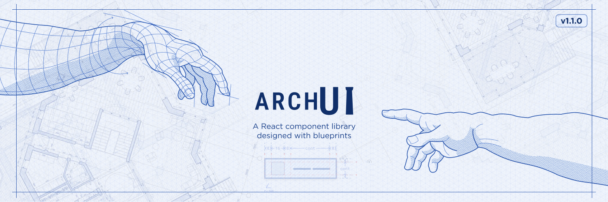

# ArchUI

A simple, modern React component library.

## About

ArchUI is a modern React component library inspired by classical architecture. It provides flexible, themeable UI primitives based on the three main architectural orders: **Doric** (minimal and sturdy), **Ionic** (elegant and balanced), and **Corinthian** (ornate and expressive). Effortlessly switch between these styles to match your design language, while enjoying a robust and accessible developer experience.

## Install

```bash
npm install @devtoti/archui-lib
```

## Usage

```tsx
import { Button } from "@devtoti/archui-lib";
import "@devtoti/archui-lib/styles";

function App() {
  return <Button intent="primary">Click me</Button>;
}
```

## Scripts

```bash
npm run dev        # Start dev server
npm run storybook  # Launch Storybook
npm run build:lib  # Build the library
npm run test       # Run tests
```

## Publishing

```bash
npm run build:lib
npm publish --access public
```
